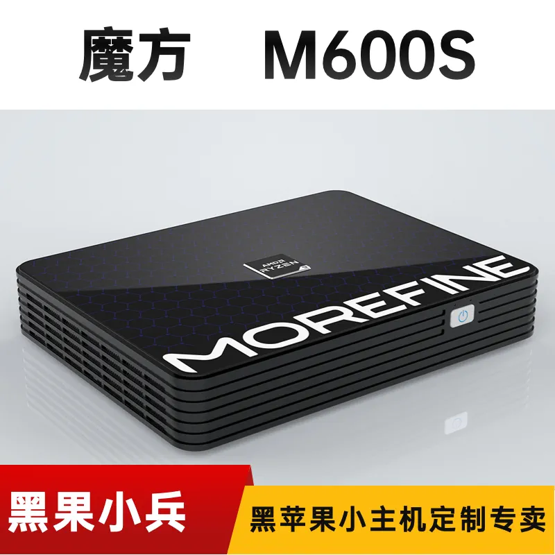
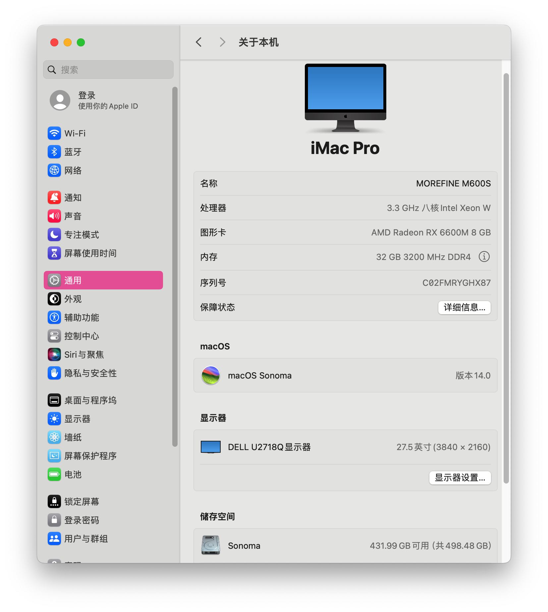
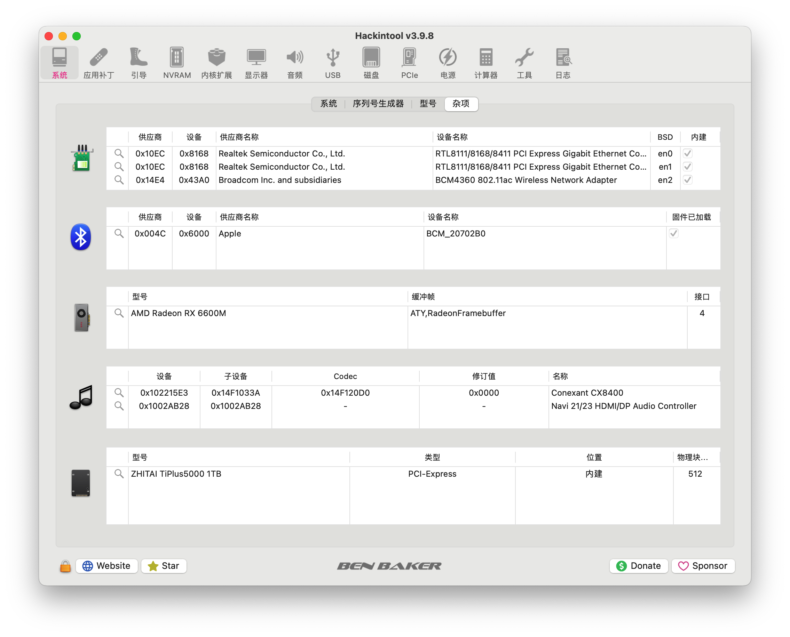
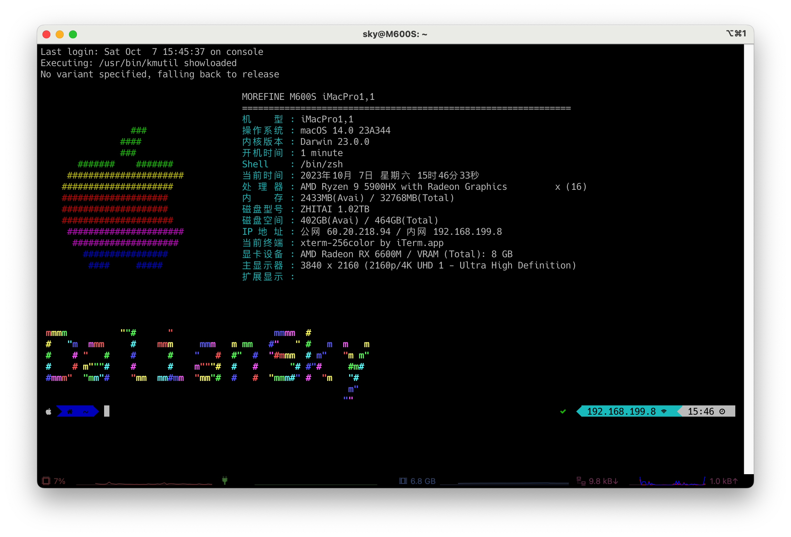
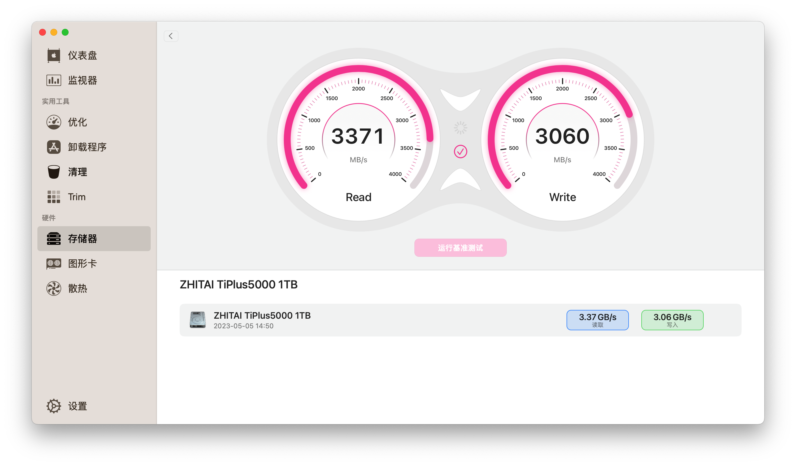
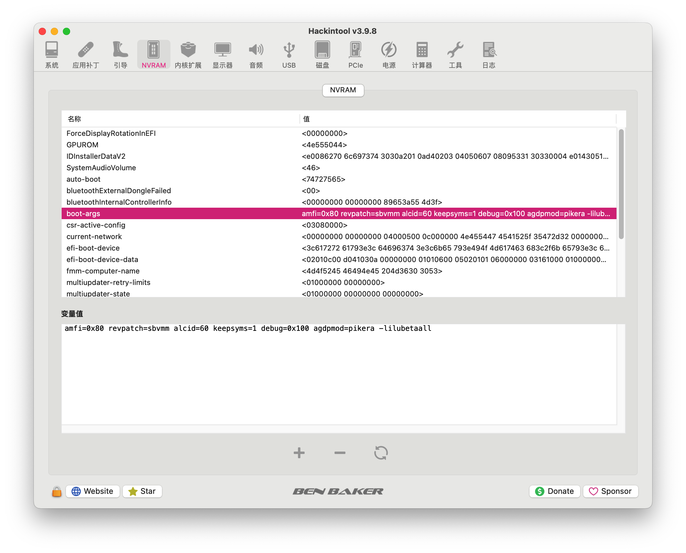
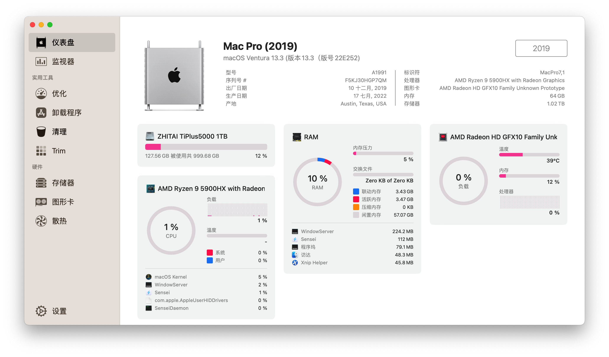
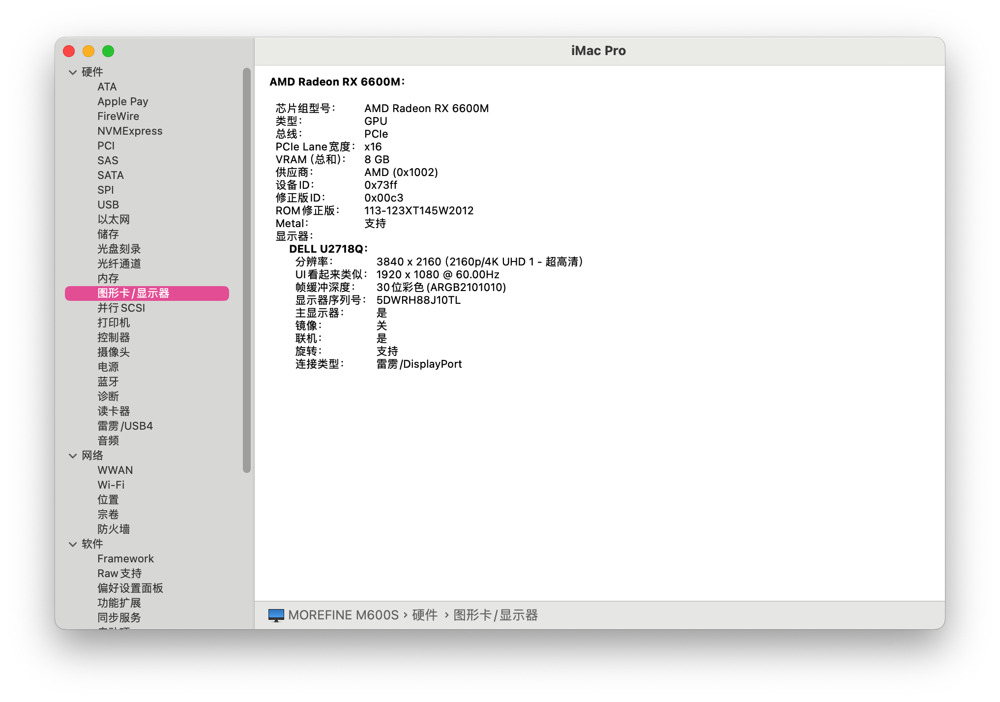
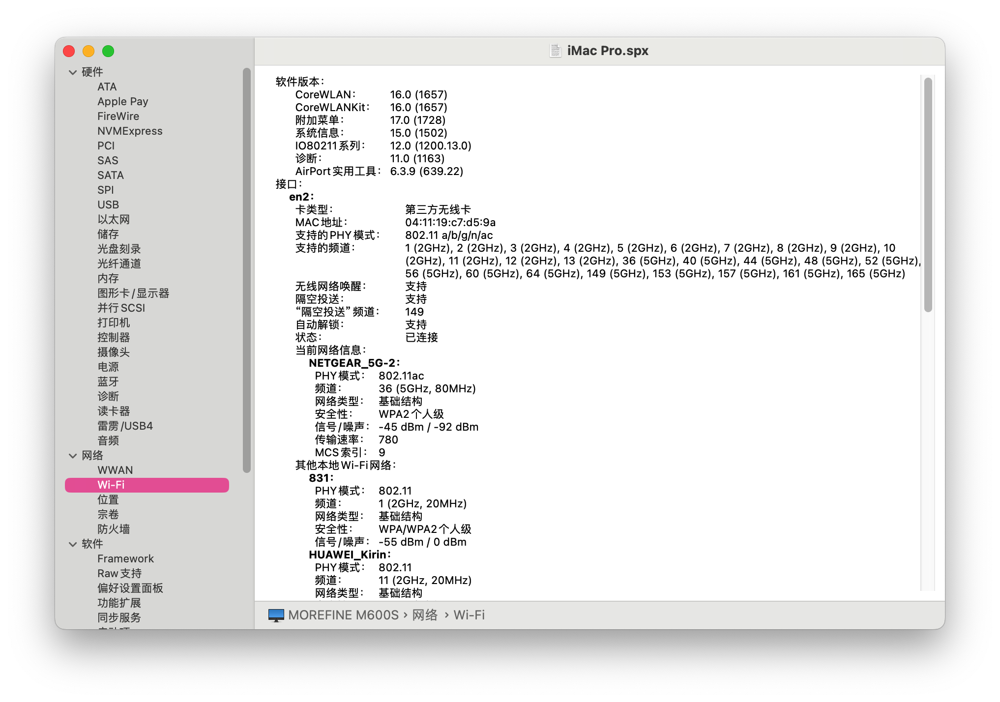

# morefine M600s miniPC Hackintosh

 

## 电脑配置

|   规格   |                           详细信息                           |
| :------: | :----------------------------------------------------------: |
| 电脑型号 |                    morefine M600s miniPC                     |
| 操作系统 |           macOS `Sonoma` /  `Ventura` / `Monterey`           |
|  处理器  |           AMD 锐龙 R9-5900HX 8核16线程`完美黑苹果`           |
|   内存   |                      64 GB DDR4 3200MHz                      |
| 硬盘1/2  |                  支持NVMe或NVMe+SATA 2.5寸                   |
|   显卡   |                 AMD Radeon RX6600m 8GB GDDR6                 |
| 显示接口 |   DP 1.4x1(4K@144Hz) [HX90G/HX80G] + HDMI 2.1x2(4K@144Hz)    |
|   声卡   |                  Conexant CX8400 `alcid=60`                  |
| 无线网卡 | m.2 NGFF插槽，已更换为[BCM94360Z3](https://blog.daliansky.net/uploads/WeChatandShop.png) |
| 有线网卡 |                      Realtek RTL8111 x2                      |

## 更新日志

- 10-7-2023
  - 更新 `OpenCore` 到 `v0.9.5`
  - 提供对 `Sonoma` 的初步支持
  - 博通网卡需要使用 `OCLP` 打补丁，附：[教程链接](https://blog.daliansky.net/OCLP.html)

## 应用兼容列表

> 多亏了[AMD vanilla 补丁](https://github.com/AMD-OSX/AMD_Vanilla)，我们甚至可以在现代 AMD 机器上运行最新的 macOS，而无需创建自定义内核，但仍有一些警告。
> 
> 某些应用程序使用臭名昭著的英特尔 MKL 库，现在称为英特尔 OneAPI：这些库兼容 x86_64，但在 macOS 移植中，某些功能仅适用于真正的英特尔 CPU：它们是 __intel_fast_memset.A 和 __intel_fast_memcpy.A。
> 
> 我们可以欺骗这些库，将这些调用重定向到 __intel_fast_memset.J 和 __intel_fast_memcpy.J，它们在 AMD Hackintoshes 上完美运行，并且考虑到我们缺少 AVX512 的事实，尽可能快。
> 
> 但是我们还需要欺骗他们更改函数 __mkl_serv_intel_cpu_true 来返回 TRUE，即使在 AMD cpus 上运行也是如此。
> 
> 仅使用这三个"补丁"，我们就可以使每个仅英特尔应用程序在我们的 AMD Hacks 上本地运行，而无需使用虚拟机管理程序，也无需绕过或删除我们特定应用程序的重要功能/文件。

请移步：[这里](https://www.macos86.it/topic/5479-amd-new-applications-life/)

用到的工具：[这里](https://github.com/NyaomiDEV/AMDFriend)

## 截屏

## 鸣谢

- [macos86.it](https://www.macos86.it/)
- 
